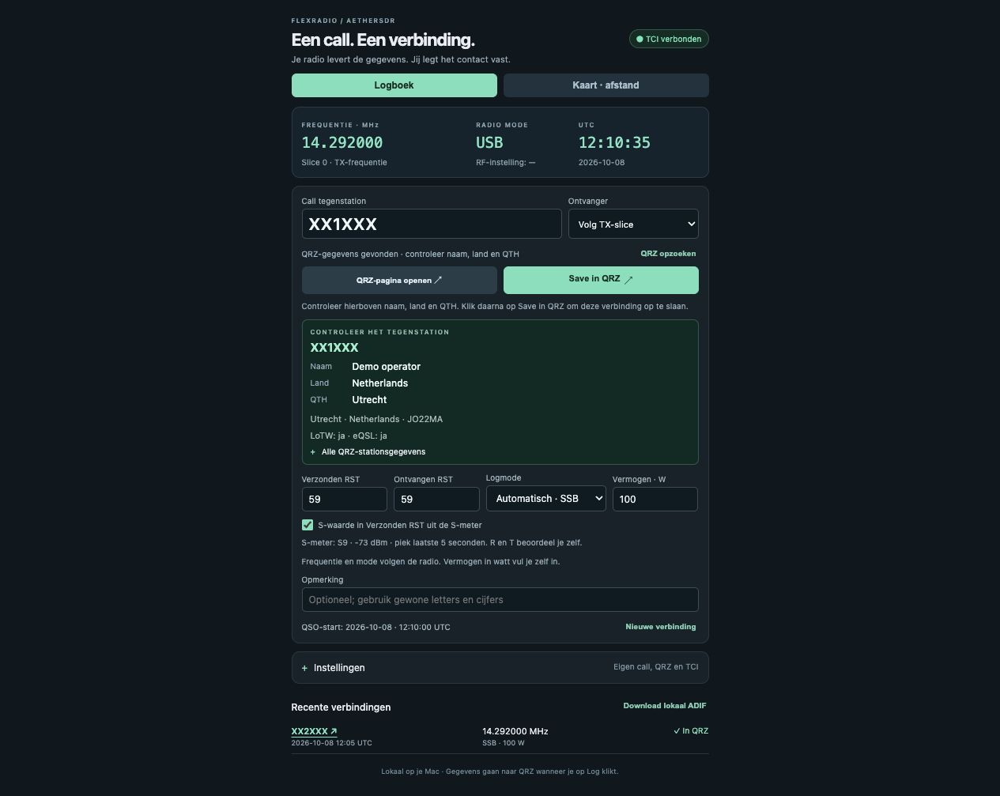
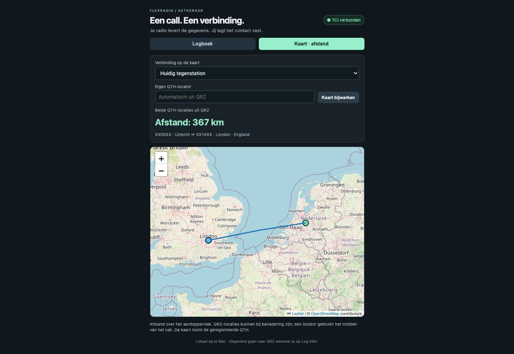

# Aether QRZ Logger

A small, local browser interface for logging FlexRadio / AetherSDR contacts directly to QRZ Logbook on macOS. Enter a callsign, review the station details, then click **Save in QRZ**.

English · [Nederlandse handleiding](README.nl.md)

First public version, tested with FlexRadio and AetherSDR on macOS. The interface is currently in Dutch. Other radios, TCI implementations and operating systems have not been extensively tested.





*Screenshots with fictional demonstration callsigns and station details.*

## Features

- Frequency, mode and selected slice from AetherSDR via TCI, including split RX/TX frequency.
- UTC start time captured when you begin entering the callsign.
- QRZ station lookup with name, country and QTH review before saving.
- Optional sent S report from the receiver's signal meter; received reports remain manual.
- Station metadata included in ADIF where available.
- Map tab with a great-circle connection line and distance from your QTH to the other station.
- Clickable callsigns in recent contacts, opening their public QRZ pages.
- Local SQLite QSO history and ADIF export with upload status.
- No radio control or transmit commands.

## Requirements

- Python **3.10 or newer**. No extra Python packages are required.
- A modern browser; Safari or Chrome is recommended.
- FlexRadio with [AetherSDR](https://www.aethersdr.com), with its TCI server enabled.
- A QRZ Logbook API key for the correct logbook, with a subscription permitting API INSERT.
- QRZ username/password and XML subscription access for station details. Saving requires name, country and QTH to be available for the entered callsign.
- Internet for QRZ lookups/uploads and the map background.

The Logbook API key and XML login serve different purposes. See the official [QRZ Logbook API guide](https://www.qrz.com/docs/logbook/QRZLogbookAPI.html) and [XML specification](https://www.qrz.com/docs/xml/current_spec.html).

## Start on macOS

1. Download the source using **Code → Download ZIP**, extract it, or clone this repository.
2. Start AetherSDR, connect your FlexRadio and enable the TCI server (normally port **50001**).
3. In Terminal, change to the extracted project folder and run:

   ```sh
   python3 server.py
   ```

   Keep that Terminal window open while logging. Stop with **Ctrl+C**.
4. Your browser opens at [127.0.0.1:8765](http://127.0.0.1:8765/).
5. Open **Instellingen** (Settings). Enter your own callsign, QRZ Logbook API key and QRZ XML login. For AetherSDR on the same Mac, use `ws://127.0.0.1:50001`.
6. Set your default transmit power in watts and save the settings.

For subsequent launches, double-click **Start logboek.command**. If macOS does not recognize it as executable after downloading, run `chmod +x "Start logboek.command"` in the project folder. Python 3 must be available as `python3`.

If the logger already runs, the launcher opens the existing instance. To start without opening a browser, use `python3 server.py --no-browser`.

## Log a contact

Enter the other station's callsign. Check the QRZ name, country and QTH, frequency, mode, reports and power. Click **Save in QRZ** to upload. Enter in the callsign field only performs a lookup.

TCI reports RF drive as a percentage, not output power in watts. Enter actual power yourself, including an amplifier if used. Select the actual digital mode for DIGU/DIGL; TCI cannot infer FT8 or FT4 from those modes alone.

The optional S report uses a five-second receive peak. R and T still need your assessment. Signal strength can include noise or another signal; check the proposed report. Digital reports such as FT8 are manual.

For detailed operation, signal-meter behavior and ADIF fields, see the [Dutch manual](README.nl.md).

## Map and distance

Open **Kaart · afstand**. Choose the current station or a recent contact. Your QTH is looked up using your configured callsign. You can override it with a Maidenhead locator using **Eigen QTH-locator** and **Kaart bijwerken**; this override is stored in that browser.

The map uses QRZ coordinates, falling back to the center of a locator square. Distance is the shortest surface distance, rounded to kilometers. QRZ shows the registered QTH, which can differ from a portable operating location. Missing coordinates are reported rather than inferred from a country.

The map uses Leaflet 1.9.4 (loaded on demand from unpkg) and [OpenStreetMap](https://www.openstreetmap.org/copyright) tiles. The map requires internet; a map-loading failure does not prevent logging.

## Local data and credentials

The server listens only on `127.0.0.1:8765`. QRZ requests use HTTPS. Credentials are kept in server memory by default. You can separately enable local storage of the API key and XML password in Settings.

Locally saved credentials are **unencrypted** in `data/settings.json`, restricted to your macOS account using file permissions. The local QSO database is `data/log.sqlite3`. Station profiles, including any returned addresses or other personal details, are stored with contacts.

The `data/` folder, ADIF exports, credentials and local screenshots are excluded from Git. Do not include them when sharing a copy of the application or reporting a problem.

Each upload is recorded locally first. Only a confirmed QRZ response is marked **In QRZ**. If an answer is lost, QRZ may still have stored the contact: check QRZ before resubmitting. The application does not automatically retry uploads or replace duplicate contacts. ADIF export includes failed and uncertain uploads with `APP_AETHERQRZ_STATUS`; review it before importing elsewhere.

## Known limitations

- Station name, country and QTH are required before saving; unavailable XML data blocks Save.
- Browser popup behavior varies. Some browsers cannot close the QRZ window programmatically; close it manually.
- Map locations reflect QRZ's registered QTH or locator, rather than a live station position.
- Frequency validation covers 160 m through 70 cm, including 60 m and 4 m. This is not a check of local operating privileges.

## Development and tests

Python tests and Node.js tests use simulated QRZ responses. They do not upload real contacts. Node.js is needed for the JavaScript tests only, not to run the logger.

```sh
python3 -m unittest -v test_server.py
node test_tci.js
node test_workflow.js
```

Please include macOS, Python, browser and AetherSDR versions when reporting issues. Remove credentials and personal station data from logs and screenshots.

## License

[MIT](LICENSE). Independent project; not affiliated with or endorsed by FlexRadio, AetherSDR or QRZ. Third-party libraries and map data retain their own licenses and attribution requirements.
